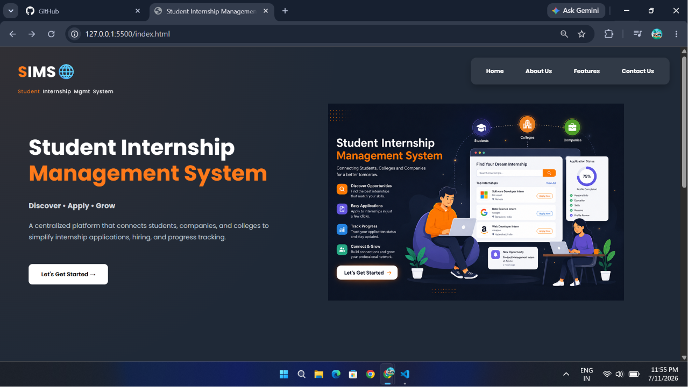

# 🎓 Student Internship Management System (SIMS)

<p align="center">
  
</p>

<p align="center">


</p>

---

## 📖 About the Project

The **Student Internship Management System (SIMS)** is a responsive web application developed as a **Bachelor of Engineering (Computer Engineering) Mini Project**.

The system streamlines internship management by providing dedicated portals for **Students**, **Companies**, and **Administrators**. It offers an intuitive interface for browsing internships, managing applications, posting internship opportunities, and monitoring overall platform activities.

> **Current Version:** Frontend Prototype (HTML, CSS & JavaScript)

---

# ✨ Features

## 👨‍🎓 Student Portal

- Dashboard
- Student Profile
- Browse Internships
- Internship Details
- Apply for Internship
- Saved Internships
- My Applications
- Notifications
- Settings

---

## 🏢 Company Portal

- Company Dashboard
- Company Profile
- Post Internship
- Manage Internships
- View Applications
- Shortlisted Students
- Interview Schedule
- Settings

---

## 👨‍💼 Admin Portal

- Admin Dashboard
- Manage Students
- Manage Companies
- Manage Internships
- Reports
- Settings

---

# 🛠 Technology Stack

| Technology | Purpose |
|------------|---------|
| HTML5 | Structure |
| CSS3 | Styling |
| JavaScript | Client-side Functionality |
| Google Fonts | Typography |

---

# 📱 Responsive Design

The project is optimized for:

- 💻 Desktop
- 💼 Laptop
- 📱 Tablet
- 📲 Mobile

---

# 📂 Project Structure

```text
Student-Internship-Management-System
│
├── Admin/
├── Company/
├── Student/
├── css/
│   ├── admin/
│   ├── company/
│   └── student/
├── js/
├── images/
├── screenshots/
├── demo/
├── SIMS_User_Guide.pdf
└── README.md
```

---

# 📸 Project Screenshots

## 🔐 Login Page


---

## 👨‍🎓 Student Dashboard


---

## 👤 Student Profile


---

## 💼 Internship Listings


---

## 📄 Internship Details


---

## 📋 My Applications


---

## 🏢 Company Dashboard


---

## ➕ Post Internship


---

## 📊 Manage Internships


---

## 👥 Company Applications


---

## 👨‍💼 Admin Dashboard


---

## 📈 Reports


---

# 🎥 Project Demonstration

A complete walkthrough video of the project is available in the **demo/** folder.

---

# 🚀 Future Enhancements

- Java Servlets Integration
- JSP
- MySQL Database
- User Authentication
- Resume Upload
- Email Notifications
- Company Verification
- Interview Scheduling
- Admin Analytics Dashboard
- Live Internship Tracking

---

# 📚 Documentation

A detailed project guide is included:

📄 **SIMS_User_Guide.pdf**

It contains:

- Project Overview
- Folder Structure
- Module Explanation
- Website Flow
- User Guide
- Future Scope

---

# 👨‍💻 Developed By

**Shreehari Patil**

Bachelor of Engineering (Computer Engineering)

---

# 🙏 Acknowledgements

Special thanks to:

- **CodeZone IT Solutions**
- **Shubhangi Shinde**
- **Pranal Madam**

for their valuable guidance, mentorship, and support throughout the development of this project.

---

# ⭐ Support

If you found this project useful, consider giving it a ⭐ on GitHub.

It motivates me to build more projects and continue learning.

---

<p align="center">
Made with ❤️ by <strong>Shreehari Patil</strong>
</p>
